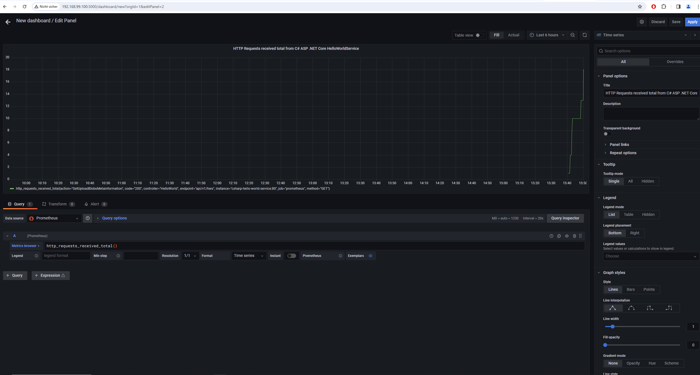

# logging-and-monitoring-samples

## Table of Contents

- [Summary](#summary)
- [References](#references)
- [How to use](#how-to-use)

## Summary

Example repository showcasing the utilization of logging and monitoring solutions, interfacing with them through backend services.

## References

- [Instrumenting a go application for prometheus](https://prometheus.io/docs/guides/go-application/)
- [Prometheus FastAPI Instrumentator](https://pypi.org/project/prometheus-fastapi-instrumentator/)
- [Github repository for actix-web-prom](https://github.com/nlopes/actix-web-prom)
- [Github repository for loki](https://github.com/grafana/loki)
- [Official rust docker images with build and serve stages](https://hub.docker.com/_/rust/)

## How to use

### Prometheus/Grafana stack

#### On Unix systems (Linux Ubuntu, Linux debian or MacOS versions)

Build and run the docker-compose network:

```sh
docker-compose -f docker-compose.prometheus-grafana-stack.yml up -d --build # or `docker compose up -d --build`
# Because the build times for individual services (especially for Rust) are relatively lengthy, you may also opt to build and execute specific services.
docker-compose -f docker-compose.prometheus-grafana-stack.yml up -d --build <service 1> <service 2> <service N>
# e.g. 
docker-compose -f docker-compose.prometheus-grafana-stack.yml up -d --build python-hello-world-service grafana prometheus
```

Access the Prometheus UI by navigating to `localhost:9090` using a web browser. Here, you can explore discovered services with a metrics endpoint.
Access the Grafana UI by visiting `localhost:3000` through a web browser. In this interface, you can create new dashboards.

#### On Windows systems with Virtual Box enabled Docker

Mounting is an issues therefore checkout comments in the [docker-compose.prometheus-grafana-stack.yml](./docker-compose.prometheus-grafana-stack.yml). Therefore comment out lines in regards to volumes.

```sh
docker-compose -f docker-compose.prometheus-grafana-stack.yml up -d --build 
# Because the build times for individual services (especially for Rust) are relatively lengthy, you may also opt to build and execute specific services.
docker-compose -f docker-compose.prometheus-grafana-stack.yml up -d --build <service 1> <service 2> <service N>
# e.g. 
docker-compose -f docker-compose.prometheus-grafana-stack.yml up -d --build python-hello-world-service grafana prometheus

docker ps # Resolve container id of prometheus container
docker exec -it <prometheus container id> sh
# Manually update the scrape_config according to the [prometheus.yml](./prometheus/prometheus.yml) with `vi` cli tool in /etc/prometheus/prometheus.yml
# Exit out of the container terminal. 
docker restart restart <prometheus container id>
```

After restarting Prometheus should be able to discover the metrics endpoints. 

Access the Prometheus UI by navigating to `localhost:9090` using a web browser. Here, you can explore discovered services with a metrics endpoint.
Access the Grafana UI by visiting `localhost:3000` through a web browser. In this interface, you can create new dashboards.

#### Results

##### ASP .NET Core metrics endpoints for Prometheus scraping


##### Go Gin metrics endpoints for Prometheus scraping


##### Python FastAPI metrics endpoints for Prometheus scraping


##### Rust Actix Web metrics endpoints for Prometheus scraping


##### Prometheus metric for total requests received


##### Grafana sample dashboard



### Loki

TBD

### Cleanup

To delete the Docker resources that have been created, execute the following commands:

```sh
sudo docker rm -f $(sudo docker ps -qa)
sudo docker system prune --volumes --force
```