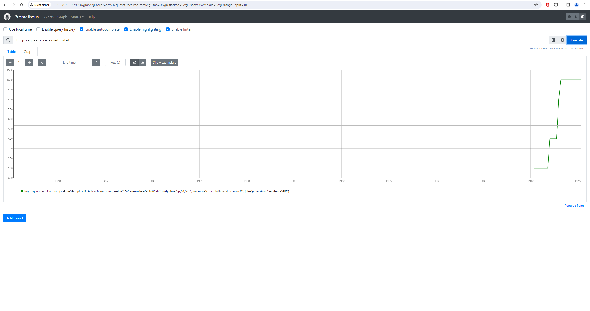

# logging-and-monitoring-samples

## Table of Contents

## Table of Contents

- [Summary](#summary)
- [References](#references)
- [How to use](#how-to-use)
  - [Prometheus/Grafana stack](#prometheusgrafana-stack)
    - [Building and running docker-compose network on Unix systems (Linux Ubuntu, Linux Debian, or MacOS versions)](#building-and-running-docker-compose-network-on-unix-systems-linux-ubuntu-linux-debian-or-macos-versions)
    - [Building and running docker-compose network on Windows systems with Virtual Box enabled Docker](#building-and-running-docker-compose-network-on-windows-systems-with-virtual-box-enabled-docker)
  - [Loki/Grafana stack](#lokigrafana-stack)
    - [Building and running docker-compose network](#building-and-running-docker-compose-network)
    - [Testing Loki endpoints](#testing-loki-endpoints)
  - [Results](#results)
    - [ASP .NET Core metrics endpoints for Prometheus scraping](#asp-net-core-metrics-endpoints-for-prometheus-scraping)
    - [Go Gin metrics endpoints for Prometheus scraping](#go-gin-metrics-endpoints-for-prometheus-scraping)
    - [Python FastAPI metrics endpoints for Prometheus scraping](#python-fastapi-metrics-endpoints-for-prometheus-scraping)
    - [Rust Actix Web metrics endpoints for Prometheus scraping](#rust-actix-web-metrics-endpoints-for-prometheus-scraping)
    - [Prometheus metric for total requests received](#prometheus-metric-for-total-requests-received)
    - [Grafana sample dashboard considering Prometheus](#grafana-sample-dashboard-considering-prometheus)
    - [Grafana sample dashboard considering Loki](#grafana-sample-dashboard-considering-loki)
  - [Cleanup](#cleanup)


## Summary

Example repository showcasing the utilization of logging and monitoring solutions, interfacing with them through backend services.

## References

- [Instrumenting a go application for prometheus](https://prometheus.io/docs/guides/go-application/)
- [Prometheus FastAPI Instrumentator](https://pypi.org/project/prometheus-fastapi-instrumentator/)
- [Github repository for actix-web-prom](https://github.com/nlopes/actix-web-prom)
- [Github repository for loki](https://github.com/grafana/loki)
- [Official rust docker images with build and serve stages](https://hub.docker.com/_/rust/)
- [Install Loki with Docker or Docker Compose](https://grafana.com/docs/loki/latest/setup/install/docker/)
- [Send log data to Loki considering third-party clients for C#, Go, Python and more](https://grafana.com/docs/loki/latest/send-data/)
- [NLog.Targets.Loki NuGet package](https://www.nuget.org/packages/NLog.Targets.Loki)
- [Grafana Loki HTTP API](https://grafana.com/docs/loki/latest/reference/api/)

## How to use

### Prometheus/Grafana stack

#### Building and running docker-compose network on Unix systems (Linux Ubuntu, Linux debian or MacOS versions)

Build and run the docker-compose network:

```sh
docker-compose -f docker-compose.prometheus-grafana-stack.yml up -d --build # or `docker compose up -d --build`
# Because the build times for individual services (especially for Rust) are relatively lengthy, you may also opt to build and execute specific services.
docker-compose -f docker-compose.prometheus-grafana-stack.yml up -d --build <service 1> <service 2> <service N>
# e.g. 
docker-compose -f docker-compose.prometheus-grafana-stack.yml up -d --build python-hello-world-service grafana prometheus
```

Access the Prometheus UI by navigating to `localhost:9090` using a web browser. Here, you can explore discovered services with a metrics endpoint.
Access the Grafana UI by visiting `localhost:3000` through a web browser. In this interface, you can create new dashboards.

#### Building and running docker-compose network on Windows systems with Virtual Box enabled Docker

Mounting is an issues therefore checkout comments in the [docker-compose.prometheus-grafana-stack.yml](./docker-compose.prometheus-grafana-stack.yml). Therefore comment out lines in regards to volumes.

```sh
docker-compose -f docker-compose.prometheus-grafana-stack.yml up -d --build 
# Because the build times for individual services (especially for Rust) are relatively lengthy, you may also opt to build and execute specific services.
docker-compose -f docker-compose.prometheus-grafana-stack.yml up -d --build <service 1> <service 2> <service N>
# e.g. 
docker-compose -f docker-compose.prometheus-grafana-stack.yml up -d --build python-hello-world-service grafana prometheus

docker ps # Resolve container id of prometheus container
docker exec -it <prometheus container id> sh
# Manually update the scrape_config according to the [prometheus.yml](./prometheus/prometheus.yml) with `vi` cli tool in /etc/prometheus/prometheus.yml
# Exit out of the container terminal. 
docker restart restart <prometheus container id>
```

After restarting Prometheus should be able to discover the metrics endpoints. 

Access the Prometheus UI by navigating to `localhost:9090` using a web browser. Here, you can explore discovered services with a metrics endpoint.
Access the Grafana UI by visiting `localhost:3000` through a web browser. In this interface, you can create new dashboards.

### Loki/Grafana stack

#### Building and running docker-compose network

Build and run the docker-compose network:

```sh
docker-compose -f docker-compose.loki.yml up -d --build # or `docker compose up -d --build`
```

#### Testing Loki endpoints

To check Loki endpoints, run following curl commands:

```sh
# On Windows OS with Virtual Box enabled Docker
curl.exe -X GET http://192.168.99.100:3100/ready
curl.exe -X GET http://192.168.99.100:3100/loki/api/v1/labels
curl.exe -v -H "Content-Type: application/json" -XPOST -s "http://192.168.99.100:3100/loki/api/v1/push" --data-raw '{"streams": [{"stream": { "foo": "bar2" }, "values": [ [ "1570818238000000000", "fizzbuzz" ] ] }]}'
curl.exe -X GET http://192.168.99.100:3100/loki/api/v1/label/foo/values

# On Unix systems
curl -X GET http://localhost:3100/ready
curl -X GET http://localhost:3100/loki/api/v1/labels
curl -v -H "Content-Type: application/json" -XPOST -s "http://localhost:3100/loki/api/v1/push" --data-raw '{"streams": [{ "stream": { "foo": "bar2" }, "values": [ [ "1570818238000000000", "fizzbuzz" ] ] }]}'
curl -X GET http://localhost:3100/loki/api/v1/label/foo/values
```

You can also refer to the [sample_loki_script.py](backend-services/loki-grafana-stack/python/script/sample_loki_script.py) which can be executed once a Loki docker instance is runnning. E.g.

```sh
# Install pip dependencies
pip install -r requirements.txt
# On Windows OS with Virtual Box enabled Docker
python.exe .\sample_loki_script.py --loki-url 192.168.99.100:3100

# On Unix systems
python.exe .\sample_loki_script.py --loki-url localhost:3100

# You can expect to receive a status code of 204. Access the Grafana service running within the Docker Compose cluster by navigating to 192.168.99.100:3000 using a web browser. From there, you'll be able to create a dashboard, utilizing the Loki datasource.
```

### Results

#### ASP .NET Core metrics endpoints for Prometheus scraping


#### Go Gin metrics endpoints for Prometheus scraping


#### Python FastAPI metrics endpoints for Prometheus scraping


#### Rust Actix Web metrics endpoints for Prometheus scraping


#### Prometheus metric for total requests received



#### Grafana sample dashboard considering Prometheus


#### Grafana sample dashboard considering Loki


### Cleanup

To delete the Docker resources that have been created, execute the following commands:

```sh
sudo docker rm -f $(sudo docker ps -qa)
sudo docker system prune --volumes --force
```