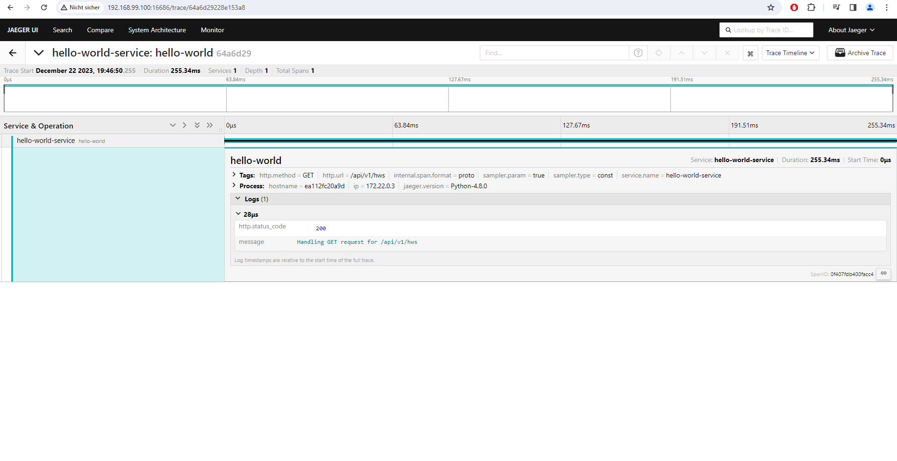

# logging-monitoring-and-tracing-samples

## Table of Contents

- [Summary](#summary)
- [References](#references)
- [How to use](#how-to-use)


## Summary

Example repository showcasing the utilization of logging, monitoring and tracing solutions, communicating with them through backend services.

## References

- [Instrumenting a go application for prometheus](https://prometheus.io/docs/guides/go-application/)
- [Prometheus FastAPI Instrumentator](https://pypi.org/project/prometheus-fastapi-instrumentator/)
- [Github repository for actix-web-prom](https://github.com/nlopes/actix-web-prom)
- [Github repository for loki](https://github.com/grafana/loki)
- [Official rust docker images with build and serve stages](https://hub.docker.com/_/rust/)
- [Install Loki with Docker or Docker Compose](https://grafana.com/docs/loki/latest/setup/install/docker/)
- [Send log data to Loki considering third-party clients for C#, Go, Python and more](https://grafana.com/docs/loki/latest/send-data/)
- [Grafana Loki HTTP API](https://grafana.com/docs/loki/latest/reference/api/)
- [loki-logger Rust crate](https://crates.io/crates/loki-logger)
- [Serilog-Sinks-Loki Github repository](https://github.com/JosephWoodward/Serilog-Sinks-Loki)
- [Go promtail-client example](https://github.com/e-kostylov/promtail-client/blob/506f3f921e9c/examples/client-example/main.go)
- [Get up and running with Jaeger in your local environment](https://www.jaegertracing.io/docs/1.6/getting-started/)

## How to use

### Prerequisite

- Install the [Docker Engine](https://docs.docker.com/engine/install/)

### Prometheus/Grafana stack

#### Building and running docker-compose network 

Build and run the docker-compose network:

```sh
docker compose -f docker-compose.prometheus-grafana-stack.yml up -d --build # or `docker compose up -d --build`
# Because the build times for individual services (especially for Rust) are relatively lengthy, you may also opt to build and execute specific services.
docker compose -f docker-compose.prometheus-grafana-stack.yml up -d --build <service 1> <service 2> <service N>
# e.g. 
docker compose -f docker-compose.prometheus-grafana-stack.yml up -d --build python-hello-world-service grafana prometheus
```

Access the Prometheus UI by navigating to `localhost:9090` using a web browser. Here, you can explore discovered services with a metrics endpoint.
Access the Grafana UI by visiting `localhost:3000` through a web browser. In this interface, you can create new dashboards.


### Loki/Grafana stack

#### Building and running docker-compose network

Build and run the docker-compose network:

```sh
docker compose -f docker-compose.loki-grafana-stack.yml up -d --build # or `docker compose up -d --build`
# Because the build times for individual services (especially for Rust) are relatively lengthy, you may also opt to build and execute specific services.
docker compose -f docker-compose.loki-grafana-stack.yml up -d --build <service 1> <service 2> <service N>
# e.g. 
docker compose -f docker-compose.loki-grafana-stack.yml up -d --build python-hello-world-service grafana loki
```

#### Testing Loki endpoints

To check Loki endpoints, run following curl commands:

```sh
curl -X GET http://localhost:3100/ready # You must ensure that the status changes from "Ingester not ready: waiting for 15s after being ready" to "ready". Else the communication to the Loki server will fail
curl -X GET http://localhost:3100/loki/api/v1/labels
curl -v -H "Content-Type: application/json" -XPOST -s "http://localhost:3100/loki/api/v1/push" --data-raw '{"streams": [{ "stream": { "foo": "bar2" }, "values": [ [ "1570818238000000000", "fizzbuzz" ] ] }]}'
curl -X GET http://localhost:3100/loki/api/v1/label/foo/values
```

You can also refer to the [sample_loki_script.py](backend-services/loki-grafana-stack/python/script/sample_loki_script.py) which can be executed once a Loki docker instance is runnning. E.g.

```sh
# Install pip dependencies
pip install -r requirements.txt

python ./sample_loki_script.py --loki-url localhost:3100

# You can expect to receive a status code of 204. Access the Grafana service running within the Docker Compose cluster by navigating to 192.168.99.100:3000 using a web browser. From there, you'll be able to create a dashboard, utilizing the Loki datasource.
```

### Jaeger

#### Building and running docker-compose network with Jaeger

Build and run the docker-compose network:

```sh
docker compose -f docker-compose.jaeger.yml up -d --build # or `docker compose up -d --build`
# Because the build times for individual services (especially for Rust) are relatively lengthy, you may also opt to build and execute specific services.
docker compose -f docker-compose.jaeger.yml up -d --build <service 1> <service 2> <service N>
# e.g. 
docker compose -f docker-compose.jaeger.yml up -d --build python-hello-world-service jaeger
```

**NOTE:** The Python sample backend service makes use of the `jaeger_client` pip package. However, it's advisable to explore the [OpenTelemetry Jaeger Exporter](https://opentelemetry-python-yusuket.readthedocs.io/en/latest/ext/jaeger/jaeger.html) as preferred approach. Backend services for Go Gin, Rust Actix Web, and C# ASP .NET Core are not included in this example. Refer to the following links for guidance and instructions on getting started:
- [OpenTelemetry-Go Jaeger Exporter](https://pkg.go.dev/go.opentelemetry.io/otel/exporters/jaeger#section-readme)
- [opentelemetry-rust Github repo](https://github.com/open-telemetry/opentelemetry-rust)
- [OpenTelemtry dotnet - Getting Started with Jaeger](https://github.com/open-telemetry/opentelemetry-dotnet/blob/main/docs/trace/getting-started-jaeger/README.md)


### Results

#### ASP .NET Core metrics endpoints for Prometheus scraping


#### Go Gin metrics endpoints for Prometheus scraping


#### Python FastAPI metrics endpoints for Prometheus scraping


#### Rust Actix Web metrics endpoints for Prometheus scraping


#### Prometheus metric for total requests received


#### Grafana sample dashboard considering Prometheus


#### Grafana sample dashboard considering Loki


#### Jaeger sample trace




### Cleanup

To delete Docker resources that have been created, execute the following commands:

```sh
sudo docker rm -f $(sudo docker ps -qa)
sudo docker system prune --volumes --force
```